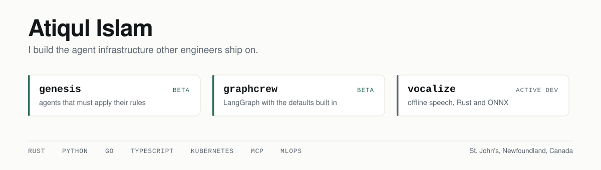

<picture>
  <source media="(prefers-color-scheme: dark)" srcset="assets/banner-dark.svg">
  
</picture>

I build agent systems and the infrastructure they run on, and I take them to production rather than
to a demo. Backend, orchestration, the platform underneath, and the tooling that makes the work
repeatable.

Right now that means three things in the open, and a day job where non programmers ship production
machine learning models through a workflow I built.

---

## genesis

**An agent builder that makes an agent provably apply its expertise.** Rust, MIT, beta, 17 releases.

An LLM agent can hold an instruction in its context and still not apply it. Writing the rule again,
in bold, higher up, works until it doesn't, and from the outside you cannot tell which of those two
states you are in.

Genesis moves enforcement outside the model. Each expertise is decomposed into rules with stable IDs.
The mechanically checkable ones compile into fail closed hooks that inject the rules before work, deny
a write that breaks one, and refuse to let the agent finish until it cites the rule IDs it applied
with evidence that resolves against the file it just produced. Whatever cannot be checked
mechanically goes to an independent reviewer on a different model, with block only authority.

Underneath: three Rust crates, a Model Context Protocol server, local ONNX embeddings pinned by
revision and SHA-256, SQLite vector search, fully offline, and a memory store that supersedes facts
instead of deleting them.

It is self hosting. Its own agents build it, under the same enforcement it applies to everything
else. Agents built with it work as the engineers on live production systems.

```
/plugin marketplace add Atiqul-Islam/genesis
/plugin install genesis@genesis
```

[Code](https://github.com/Atiqul-Islam/genesis) · [Docs](https://atiqul-islam.github.io/genesis/)

## graphcrew

**LangGraph with the best practices already in place.** Python, MIT, beta, on PyPI. Sole author.

GraphCrew exists so that building an LLM system on LangGraph does not mean solving the same problems
again. LangGraph gives you the graph. It does not decide how much context each agent gets, when to
evict a knowledge slot, what happens when a model call fails halfway through, or how to stop one
tenant spending another tenant's budget.

Already wired in: a tiered slot manager with eviction and an explicit token budget, multi pass ReAct
with bounded passes, pluggable persistence and session backends, circuit breaking and retry with
backoff, per tenant rate limiting and isolation, metrics and OpenTelemetry tracing. Crews are
declared in YAML. A MockLLM subpackage lets you test agent graphs without a single live model call.

```
pip install graphcrew
```

[Code](https://github.com/Atiqul-Islam/graphcrew)

## vocalize

**Offline text to speech.** Rust, active development.

ONNX Runtime and the Kokoro model, exposed to Python through PyO3. Runs with no network call and no
third party speech API. The work covers the inference path end to end: model loading, tokenisation,
audio synthesis, and the binding layer.

[Code](https://github.com/Atiqul-Islam/vocalize)

---

## At work

Software Developer at Instrumar, since 2022.

I built a zero code workflow that lets analysts and systems engineers, people who do not write code,
build, validate and ship production models themselves. Some of the models built through it run in
production today. The rest are built and in testing. The outcome is the point: domain experts ship
without a developer in the loop.

I own the platform underneath. A private Kubernetes cluster on Apache CloudStack (Cluster API) that I
specified, built and operate, covering hardware, network architecture, deployment and production
operations, with GitOps delivery, automated promotion and rollback, and release auditability.

I also delivered a production agentic analytics product for plant operations, full stack, with a
supervisor routing four specialist agents on LangGraph, and engineered its context management:
knowledge modules loaded on demand instead of carried, a token budget split so the stable prompt
stays cached, and history compaction that keeps metadata and drops payload until a result is needed.

---

## Stack

**Languages** Rust · Python · Go · TypeScript · C#
**Agents and LLM** LangGraph · Model Context Protocol · supervisor led orchestration · ReAct ·
context engineering · RAG · evaluation and tracing
**Platform** Kubernetes · Apache CloudStack (Cluster API) · AWS · GitOps with Helm and Kustomize
**Data** PostgreSQL and TimescaleDB · Apache Pulsar · MinIO and S3 · Trino
**Ops** Prometheus · Grafana · OpenTelemetry · CI/CD with automated promotion and rollback

B.Eng Computer Engineering, Memorial University of Newfoundland.

---

Based in St. John's, Newfoundland, Canada. Open to remote work anywhere, full time or contract, and
to on site or hybrid roles in Canada.

[LinkedIn](https://www.linkedin.com/in/atiqul-islam-3218851b5/)
